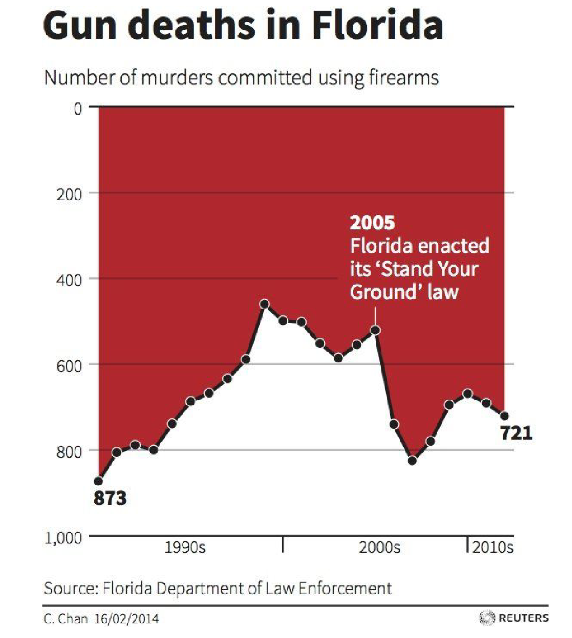
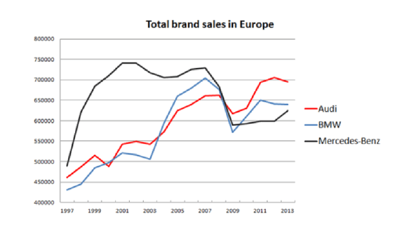
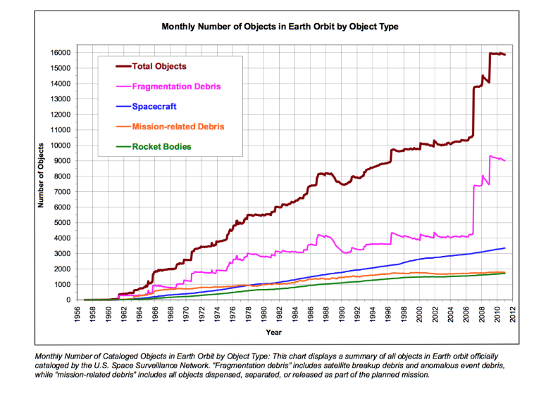

# Review of the graphs

## Graph 1 

### Data
- [X] The type of the graphic is adapted to the nature of data (curve, bars, pie, histogram, cloud...) ;
- [X] Approximations/interpolation make sense ;
- [X] Curves are defined by a sufficient number of points ;
- [X] The building method of the curve is clear: interpolation (linear, polynomial, regression...) ;
- [ ] Confidence intervals are visualized (or given separately) ;
- [ ] Steps of histograms are adequate ;
- [ ] Histograms visualize probabilities (from 0 to 1).

### Graphical objects
- [X] Graphical objects are readable on screen, on printed version (B/W), on video... ;
- [X] Graphic range is standard, without too similar colors, without green (video) ;
- [ ] Graphical axis are well identified and labeled;
- [ ] Scales and units are explicit ;
- [X] Curves cross without ambiguity ;
- [ ] Grids help the reader.

### Annotation
- [X] Axis are labeled by quantities ;
- [X] Labels of the axis are clear and self-contained;
- [ ] Units are indicated on the axis ;
- [ ] Axes are oriented from the left to the right and from the bottom to the top ;
- [ ] Origin should be (0,0), if not it should be clearly justified ;
- [X] No Hole on the axes
- [ ] For bar graphs/histograms order of bars is based on classical ordering (alphabetical, temporal, from the best to the worst) are better than a random order ;
- [ ] The order of the graph/histogram bar is based on classical ordering 
- [ ] Each curve has a legend ;
- [ ] Each bar has a legend ;

### Information
- [X] Curves on the same scale
- [X] The number of curves on the same graph is small (less than 6) ;
- [X] Compare curves on the same graphic ;
- [X] A curve cannot be removed without reducing the information ;
- [X] The graphic gives a relevant information to the reader ;
- [ ] If the vertical axis shows averages, it should indicate error bars ;
- [X] It is not possible to remove any object without modifying the readability of the graphic.

### Context
- [X] All the symbols are defined and referenced in the text ;
- [X] The graphic produces more information than any other representation (choice of the variable) ;
- [X] The graphic has a title ;
- [X] The title is sufficiently self-contained to partially understand the graphic ;
- [X] The graphic is referenced in the text ;
- [ ] The text comments the figure.

  #### Last but not least: [X] The graphical representation should be elegant 

#### Comment: Although the message of the graph is clearly highlighted visually with an upper part that represents blood flowing down, it may be confusing for readers to read the graph's values because the y-axis is reversed.

## Graph 2 

### Data
- [X] The type of the graphic is adapted to the nature of data (curve, bars, pie, histogram, cloud...) ;
- [X] Approximations/interpolation make sense ;
- [X] Curves are defined by a sufficient number of points ;
- [X] The building method of the curve is clear: interpolation (linear, polynomial, regression...) ;
- [X] Confidence intervals are visualized (or given separately) ;
- [ ] Steps of histograms are adequate ;
- [ ] Histograms visualize probabilities (from 0 to 1).

### Graphical objects
- [X] Graphical objects are readable on screen, on printed version (B/W), on video... ;
- [X] Graphic range is standard, without too similar colors, without green (video) ;
- [ ] Graphical axis are well identified and labeled;
- [ ] Scales and units are explicit ;
- [X] Curves cross without ambiguity ;
- [X] Grids help the reader.

### Annotation
- [X] Axis are labeled by quantities ;
- [X] Labels of the axis are clear and self-contained;
- [ ] Units are indicated on the axis ;
- [X] Axes are oriented from the left to the right and from the bottom to the top ;
- [X] Origin should be (0,0), if not it should be clearly justified ;
- [X] No Hole on the axes
- [ ] For bar graphs/histograms order of bars is based on classical ordering (alphabetical, temporal, from the best to the worst) are better than a random order ;
- [ ] The order of the graph/histogram bar is based on classical ordering 
- [X] Each curve has a legend ;
- [ ] Each bar has a legend ;

### Information
- [X] Curves on the same scale
- [X] The number of curves on the same graph is small (less than 6) ;
- [X] Compare curves on the same graphic ;
- [X] A curve cannot be removed without reducing the information ;
- [X] The graphic gives a relevant information to the reader ;
- [ ] If the vertical axis shows averages, it should indicate error bars ;
- [X] It is not possible to remove any object without modifying the readability of the graphic.

### Context
- [ ] All the symbols are defined and referenced in the text ;
- [ ] The graphic produces more information than any other representation (choice of the variable) ;
- [X] The graphic has a title ;
- [ ] The title is sufficiently self-contained to partially understand the graphic ;
- [ ] The graphic is referenced in the text ;
- [ ] The text comments the figure.

  #### Last but not least: [X] The graphical representation should be elegant 

#### Comment: There should be labels for both of the axis (y-axis : number of sales, x-axis : year). The title should explain the graph more precisely like : Total brand sales of different car brands over years. There should also be a source of the graph mentioned.

## Graph 3 

### Data
- [X] The type of the graphic is adapted to the nature of data (curve, bars, pie, histogram, cloud...) ;
- [X] Approximations/interpolation make sense ;
- [X] Curves are defined by a sufficient number of points ;
- [X] The building method of the curve is clear: interpolation (linear, polynomial, regression...) ;
- [X] Confidence intervals are visualized (or given separately) ;
- [ ] Steps of histograms are adequate ;
- [ ] Histograms visualize probabilities (from 0 to 1).

### Graphical objects
- [ ] Graphical objects are readable on screen, on printed version (B/W), on video... ;
- [X] Graphic range is standard, without too similar colors, without green (video) ;
- [X] Graphical axis are well-identified and labeled;
- [X] Scales and units are explicit ;
- [ ] Curves cross without ambiguity ;
- [X] Grids help the reader.

### Annotation
- [X] Axis are labeled by quantities ;
- [X] Labels of the axis are clear and self-contained;
- [ ] Units are indicated on the axis ;
- [X] Axes are oriented from the left to the right and from the bottom to the top ;
- [ ] Origin should be (0,0), if not it should be clearly justified ;
- [X] No Hole on the axes
- [ ] For bar graphs/histograms order of bars is based on classical ordering (alphabetical, temporal, from the best to the worst) are better than a random order ;
- [ ] The order of the graph/histogram bar is based on classical ordering 
- [X] Each curve has a legend ;
- [ ] Each bar has a legend ;

### Information
- [X] Curves on the same scale
- [X] The number of curves on the same graph is small (less than 6) ;
- [X] Compare curves on the same graphic ;
- [X] A curve cannot be removed without reducing the information ;
- [X] The graphic gives a relevant information to the reader ;
- [ ] If the vertical axis shows averages, it should indicate error bars ;
- [X] It is not possible to remove any object without modifying the readability of the graphic.

### Context
- [ ] All the symbols are defined and referenced in the text ;
- [ ] The graphic produces more information than any other representation (choice of the variable) ;
- [X] The graphic has a title ;
- [ ] The title is sufficiently self-contained to partially understand the graphic ;
- [ ] The graphic is referenced in the text ;
- [X] The text comments the figure.

  #### Last but not least: [ ] The graphical representation should be elegant 

#### Comment: Even though this graphic has a lot of good points, it can be improved in some ways. There are too many points on the x-axis and y-axis, it would be better to increase the step between values on the axes to reduce the density and make the graph more readable. The title exists but it describes the graph as a "monthly" representation while on the x-axis we have years. Since it is a scientific graph, a reference should be mentioned. 

